# 🎯 Roadmap Visual - Sistema POS

## 📊 Diagrama de Gantt - Timeline General

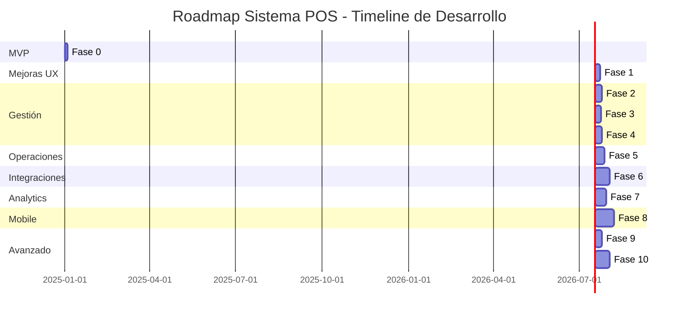

---

## 🏗️ Arquitectura del Sistema

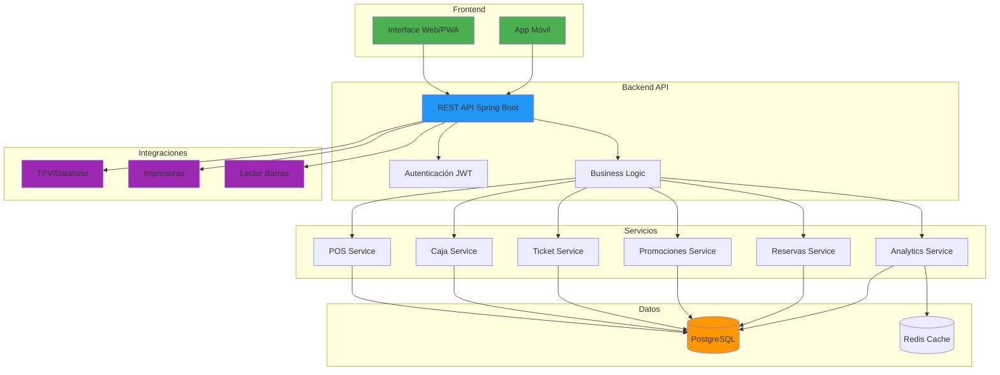

---

## 🔄 Flujo de Registro de Consumo

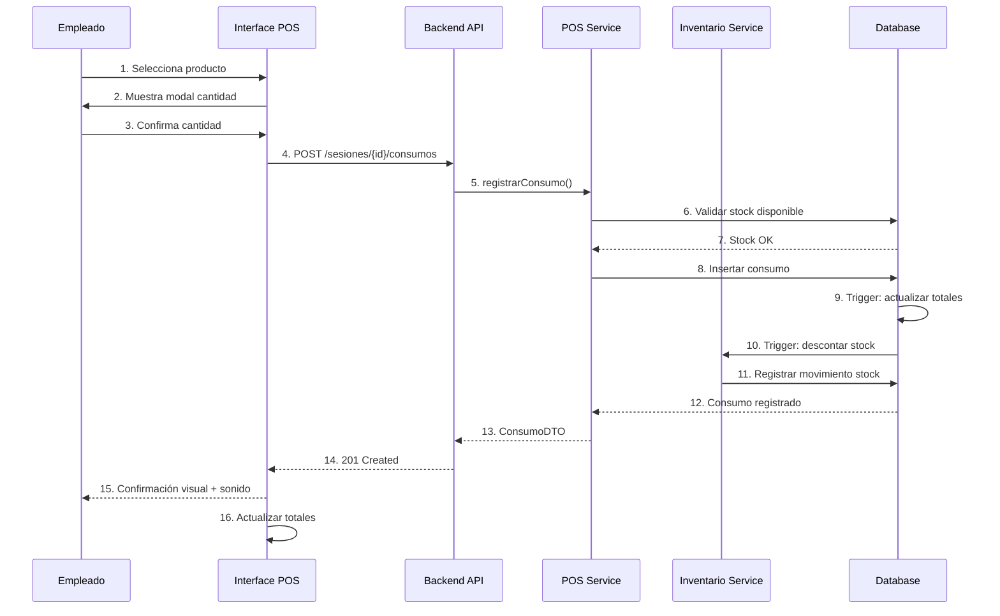

---

## 📈 Evolución del Sistema - Fases

```mermaid
graph LR
    F0[Fase 0<br/>MVP<br/>📝]
    F1[Fase 1<br/>UX Mejorado<br/>✨]
    F2[Fase 2<br/>Gestión Caja<br/>💰]
    F3[Fase 3<br/>Tickets<br/>🎫]
    F4[Fase 4<br/>Promociones<br/>🏷️]
    F5[Fase 5<br/>Mesas<br/>🪑]
    F6[Fase 6<br/>Integraciones<br/>🔗]
    F7[Fase 7<br/>Analytics<br/>📊]
    F8[Fase 8<br/>App Móvil<br/>📱]
    F9[Fase 9<br/>Seguridad<br/>🔐]
    F10[Fase 10<br/>Multi-Local<br/>🌐]

    F0 --> F1
    F1 --> F2
    F2 --> F3
    F3 --> F4
    F4 --> F5
    F5 --> F6
    F6 --> F7
    F7 --> F8
    F8 --> F9
    F9 --> F10

    style F0 fill:#4CAF50,color:#fff
    style F1 fill:#8BC34A,color:#fff
    style F2 fill:#CDDC39,color:#000
    style F3 fill:#FFEB3B,color:#000
    style F4 fill:#FFC107,color:#000
    style F5 fill:#FF9800,color:#fff
    style F6 fill:#FF5722,color:#fff
    style F7 fill:#F44336,color:#fff
    style F8 fill:#E91E63,color:#fff
    style F9 fill:#9C27B0,color:#fff
    style F10 fill:#673AB7,color:#fff
```

---

## 🎯 Priorización de Fases

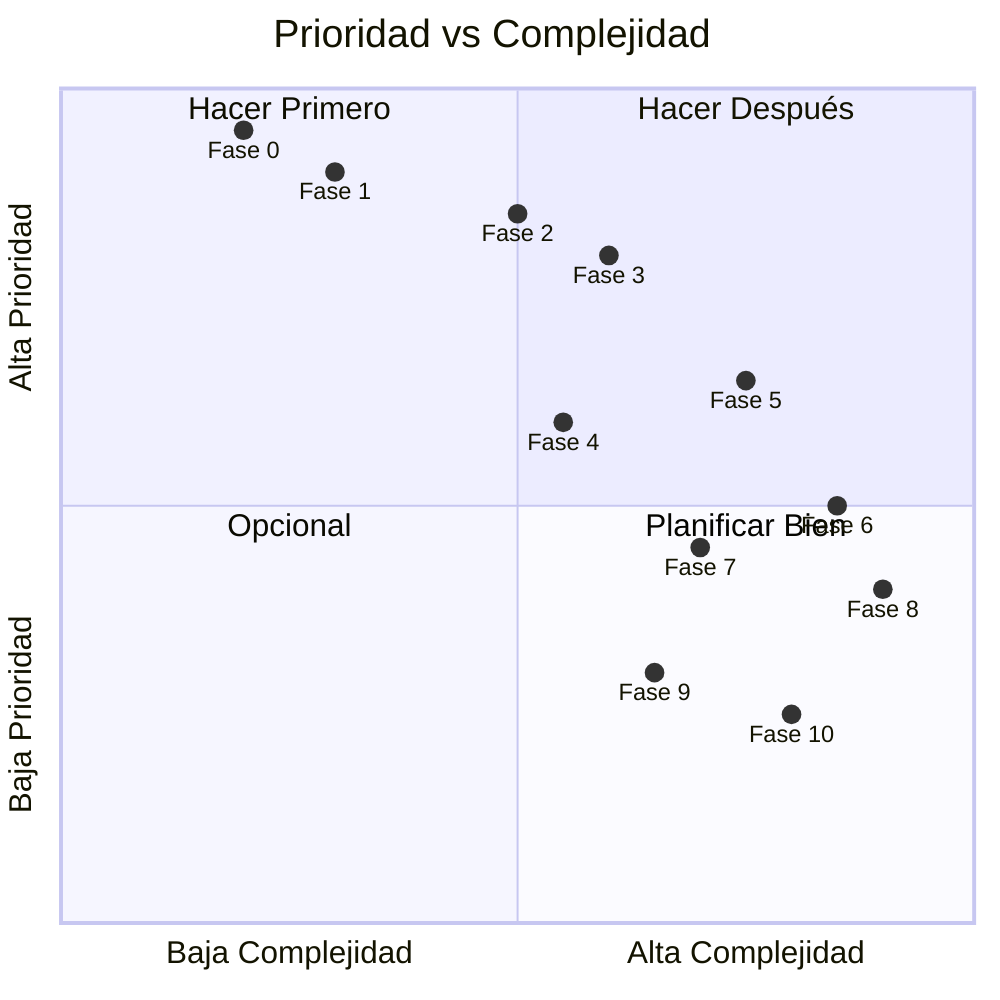

---

## 📊 Modelo de Datos - Evolución

### Fase 0: MVP

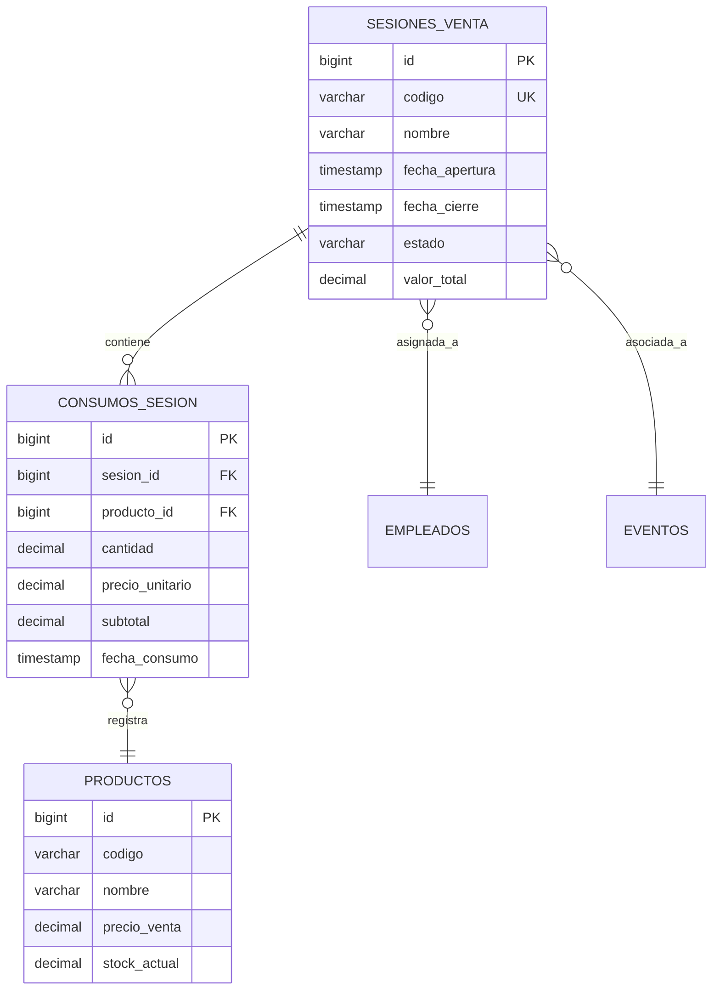

### Fase 2: + Gestión de Caja

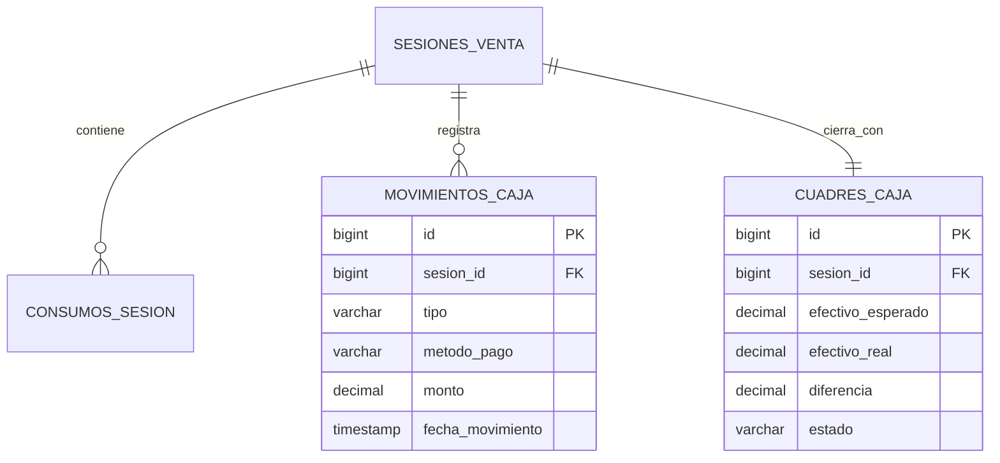

### Fase 3: + Tickets y Comandas

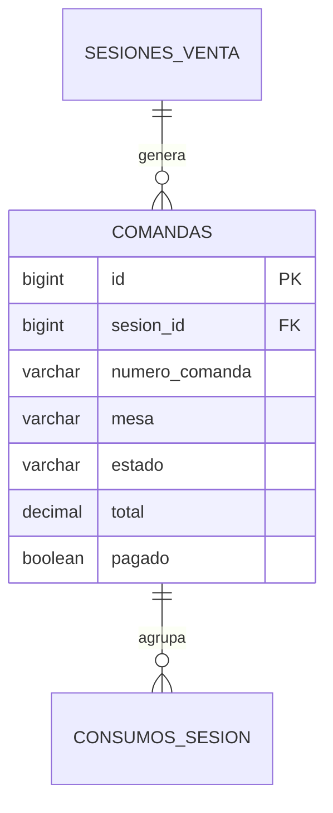

### Fase 5: + Mesas y Reservas

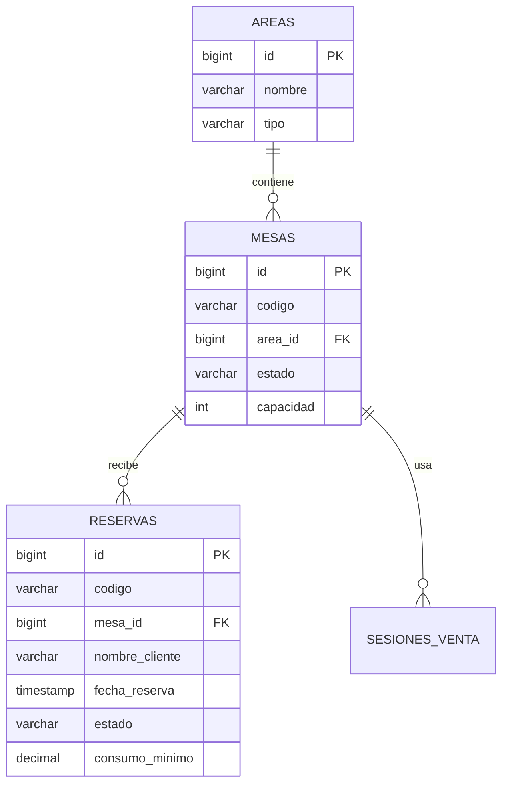

---

## 🔀 Estados del Sistema

### Estados de Sesión

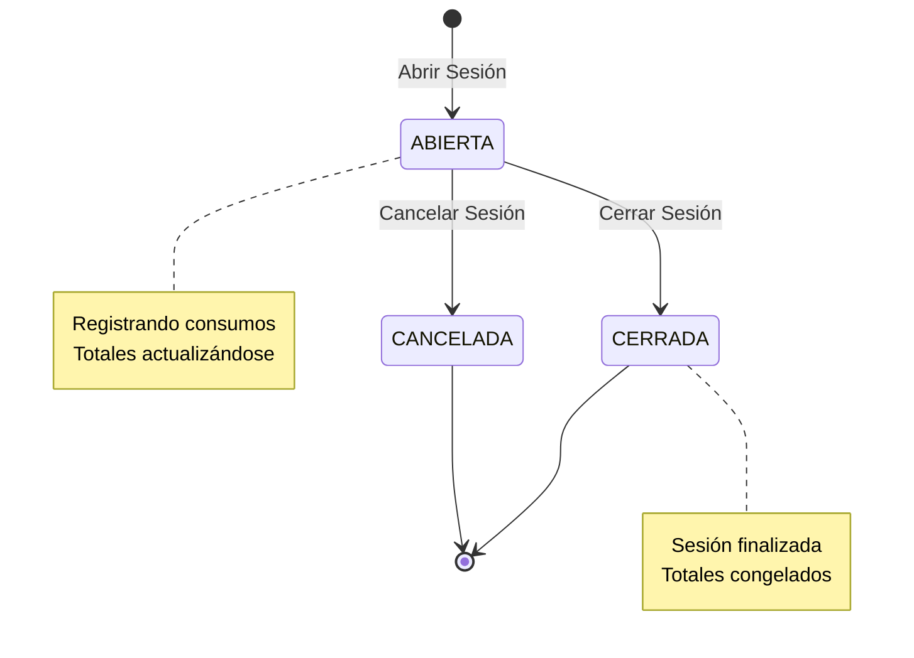

### Estados de Comanda (Fase 3)

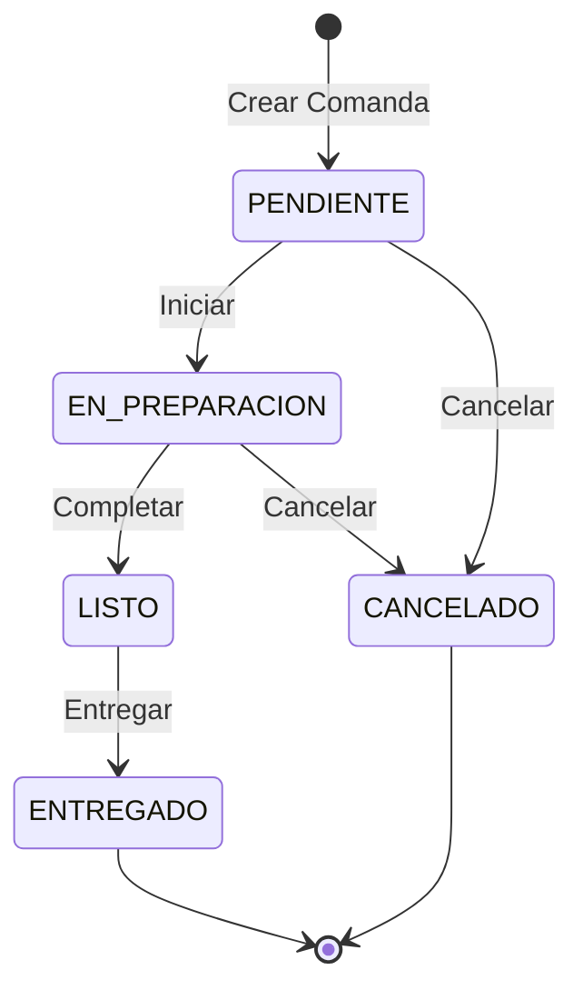

### Estados de Mesa (Fase 5)

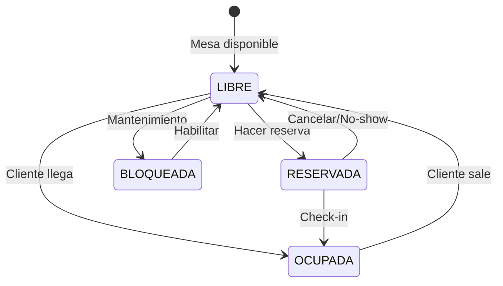

---

## 📱 Flujo de Usuario - Interfaz POS

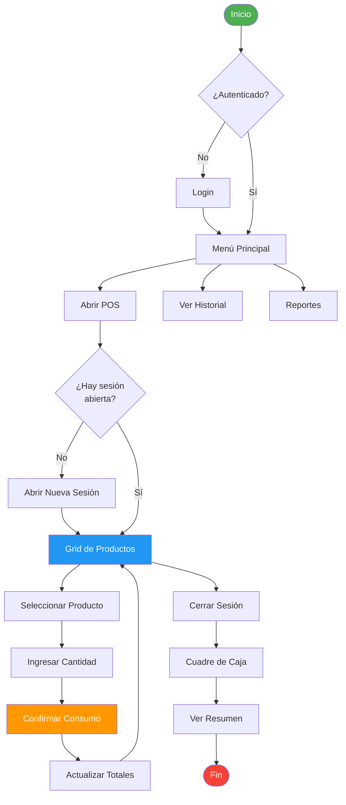

---

## 🎨 Wireframes - Fase 0 (MVP)

### Pantalla Principal POS

```
┌─────────────────────────────────────────────────────────────────────┐
│ 🏠 Club Management  │  POS                              👤 Admin ▼ │
├─────────────────────────────────────────────────────────────────────┤
│                                                                      │
│  ┌───────────────────────────────┐  ┌─────────────────────────────┐│
│  │  Sesión Activa                │  │  Totales                    ││
│  │  ━━━━━━━━━━━━━━━━━━━━━━━━━━  │  │  ━━━━━━━━━━━━━━━━━━━━━━━━  ││
│  │  SES-20251009123456           │  │  🕒 Duración: 45 min        ││
│  │  Empleado: Juan Pérez         │  │  📦 Items: 23              ││
│  │                                │  │  💰 Total: 184.50€         ││
│  │  [🔴 Cerrar Sesión]            │  │                             ││
│  └───────────────────────────────┘  └─────────────────────────────┘│
│                                                                      │
│  Productos                                   🔍 [Buscar producto...] │
│  ━━━━━━━━━━━━━━━━━━━━━━━━━━━━━━━━━━━━━━━━━━━━━━━━━━━━━━━━━━━━━  │
│                                                                      │
│  Bebidas Alcohólicas                                                │
│  ┌────────┐ ┌────────┐ ┌────────┐ ┌────────┐                       │
│  │ 🍹     │ │ 🥃     │ │ 🍾     │ │ 🍺     │                       │
│  │ Gin    │ │ Whisky │ │ Vodka  │ │ Cerveza│                       │
│  │ Tonic  │ │ Cola   │ │        │ │ Estrella│                      │
│  │        │ │        │ │        │ │        │                       │
│  │ 8.00€  │ │ 9.00€  │ │ 120€   │ │ 3.50€  │                       │
│  │ COPA   │ │ COPA   │ │BOTELLA │ │UNIDAD  │                       │
│  └────────┘ └────────┘ └────────┘ └────────┘                       │
│                                                                      │
│  Refrescos                                                          │
│  ┌────────┐ ┌────────┐ ┌────────┐                                  │
│  │ 🥤     │ │ 🧃     │ │ 💧     │                                  │
│  │ Cola   │ │ Naranja│ │ Agua   │                                  │
│  │        │ │        │ │        │                                  │
│  │ 2.50€  │ │ 2.50€  │ │ 2.00€  │                                  │
│  └────────┘ └────────┘ └────────┘                                  │
│                                                                      │
└─────────────────────────────────────────────────────────────────────┘
```

### Panel de Consumos

```
┌─────────────────────────────────────────────────────────────────┐
│  Consumos de la Sesión (12)                                     │
│  ━━━━━━━━━━━━━━━━━━━━━━━━━━━━━━━━━━━━━━━━━━━━━━━━━━━━━━━━━━  │
│                                                                  │
│  Hora    Producto           Cant.  Precio    Subtotal           │
│  ─────────────────────────────────────────────────────────────  │
│  12:45   Gin Tonic         2      8.00€     16.00€             │
│  12:47   Cerveza Estrella  1      3.50€      3.50€             │
│  12:52   Whisky Cola       1      9.00€      9.00€             │
│  12:58   Agua              2      2.00€      4.00€             │
│  13:05   Gin Tonic         3      8.00€     24.00€             │
│  13:12   Cola              1      2.50€      2.50€             │
│  13:18   Vodka (botella)   1    120.00€    120.00€             │
│  13:25   Gin Tonic         1      8.00€      8.00€             │
│  ─────────────────────────────────────────────────────────────  │
│                                     TOTAL:   184.50€            │
│                                                                  │
└─────────────────────────────────────────────────────────────────┘
```

---

## 📊 Distribución de Esfuerzo por Fase

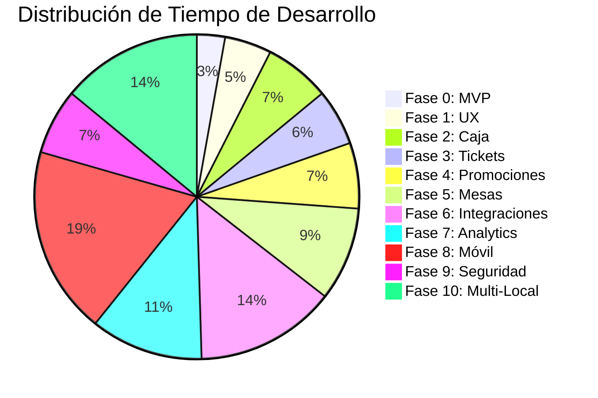

---

## 🎯 KPIs por Fase

### Fase 0: MVP
- ✅ Tiempo registro consumo < 5 seg
- ✅ Disponibilidad > 99%
- ✅ Stock actualizado en tiempo real

### Fase 1: UX Mejorado
- ✅ Clicks para registrar < 3
- ✅ Tiempo búsqueda producto < 2 seg
- ✅ Satisfacción usuario > 8/10

### Fase 2: Gestión Caja
- ✅ Cuadre automático 95% exacto
- ✅ Tiempo de cierre < 5 min
- ✅ Reducción diferencias caja -80%

### Fase 3: Tickets
- ✅ Tiempo generación ticket < 1 seg
- ✅ Tasa impresión correcta > 98%
- ✅ Tiempo cocina-entrega -30%

---

## 🚀 Releases Planificados

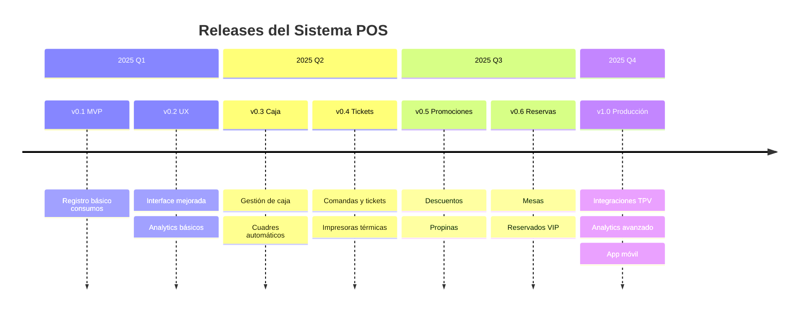

---

## 🔧 Stack Tecnológico Visual

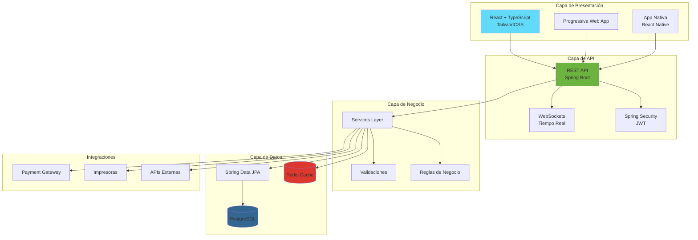

---

## 📈 Crecimiento Esperado de Funcionalidades

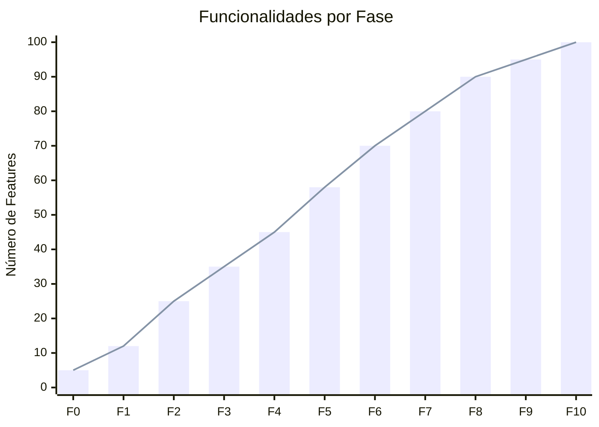

---

## 🎨 Paleta de Colores del Sistema

### Colores Principales
```
┌─────────────────┬─────────────────┬─────────────────┬─────────────────┐
│   PRIMARY       │   SECONDARY     │   SUCCESS       │   WARNING       │
│   #2196F3       │   #FF9800       │   #4CAF50       │   #FFC107       │
│   ███████████   │   ███████████   │   ███████████   │   ███████████   │
│   Azul          │   Naranja       │   Verde         │   Amarillo      │
└─────────────────┴─────────────────┴─────────────────┴─────────────────┘

┌─────────────────┬─────────────────┬─────────────────┬─────────────────┐
│   ERROR         │   INFO          │   DARK          │   LIGHT         │
│   #F44336       │   #00BCD4       │   #212121       │   #FAFAFA       │
│   ███████████   │   ███████████   │   ███████████   │   ███████████   │
│   Rojo          │   Cian          │   Gris Oscuro   │   Gris Claro    │
└─────────────────┴─────────────────┴─────────────────┴─────────────────┘
```

### Estados
- 🟢 ABIERTA - Verde (#4CAF50)
- 🔴 CERRADA - Rojo (#F44336)
- 🟡 PENDIENTE - Amarillo (#FFC107)
- 🔵 EN PROCESO - Azul (#2196F3)

---

## 📱 Responsive Design

```
┌──────────────────────────────────────────────────────────────────┐
│                                                                   │
│  Desktop (1920x1080)                                             │
│  ┌────────────────┬──────────────────────────┬─────────────────┐│
│  │  Sidebar       │  Grid Productos          │  Panel Derecho  ││
│  │  - Menú        │  ┌────┬────┬────┬────┐  │  - Sesión       ││
│  │  - POS         │  │    │    │    │    │  │  - Totales      ││
│  │  - Reportes    │  └────┴────┴────┴────┘  │  - Consumos     ││
│  │  - Config      │  ┌────┬────┬────┬────┐  │                 ││
│  │                │  │    │    │    │    │  │                 ││
│  │                │  └────┴────┴────┴────┘  │                 ││
│  └────────────────┴──────────────────────────┴─────────────────┘│
│                                                                   │
└──────────────────────────────────────────────────────────────────┘

┌─────────────────────────────────┐
│ Tablet (768x1024)               │
│ ┌─────────────────────────────┐ │
│ │ 🏠 POS          👤 Admin ▼  │ │
│ ├─────────────────────────────┤ │
│ │ Sesión Activa               │ │
│ │ Totales                     │ │
│ ├─────────────────────────────┤ │
│ │ Grid Productos              │ │
│ │ ┌──────┬──────┬──────┐     │ │
│ │ │      │      │      │     │ │
│ │ └──────┴──────┴──────┘     │ │
│ │ ┌──────┬──────┬──────┐     │ │
│ │ │      │      │      │     │ │
│ │ └──────┴──────┴──────┘     │ │
│ ├─────────────────────────────┤ │
│ │ Lista de Consumos           │ │
│ └─────────────────────────────┘ │
└─────────────────────────────────┘

┌──────────────┐
│ Mobile       │
│ (375x667)    │
│ ┌──────────┐ │
│ │☰ POS   👤│ │
│ ├──────────┤ │
│ │ Sesión   │ │
│ │ Activa   │ │
│ ├──────────┤ │
│ │ 🔍 Buscar│ │
│ ├──────────┤ │
│ │ ┌──┬──┐  │ │
│ │ │  │  │  │ │
│ │ └──┴──┘  │ │
│ │ ┌──┬──┐  │ │
│ │ │  │  │  │ │
│ │ └──┴──┘  │ │
│ ├──────────┤ │
│ │🛒 Ver    │ │
│ │  Carrito │ │
│ └──────────┘ │
└──────────────┘
```

---

## 🎓 Curva de Aprendizaje

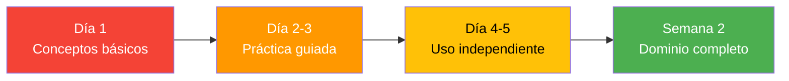

### Tiempo de Formación por Rol
- 👤 **Camarero**: 30 minutos
- 👨‍💼 **Encargado**: 2 horas
- 👔 **Gerente**: 4 horas
- 👨‍💻 **Admin**: 1 día

---

**¿Cómo visualizar estos diagramas?**
1. GitHub/GitLab renderiza Mermaid automáticamente
2. VS Code con extensión "Markdown Preview Mermaid"
3. Herramientas online: https://mermaid.live/
